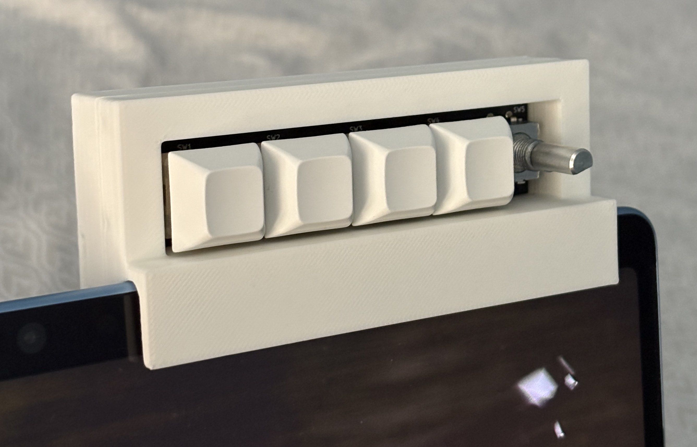
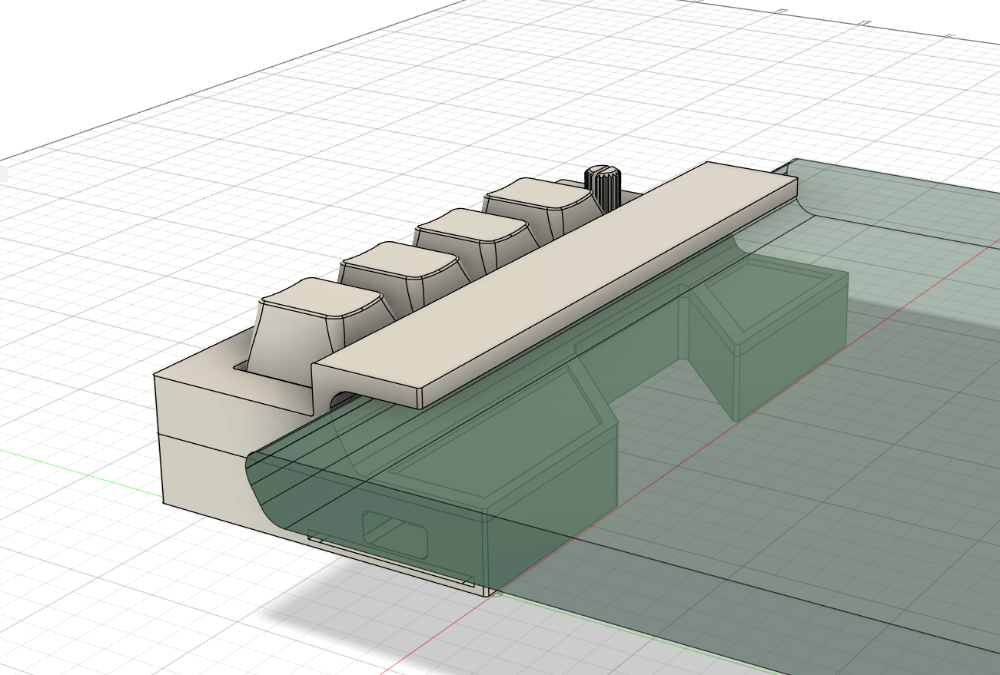
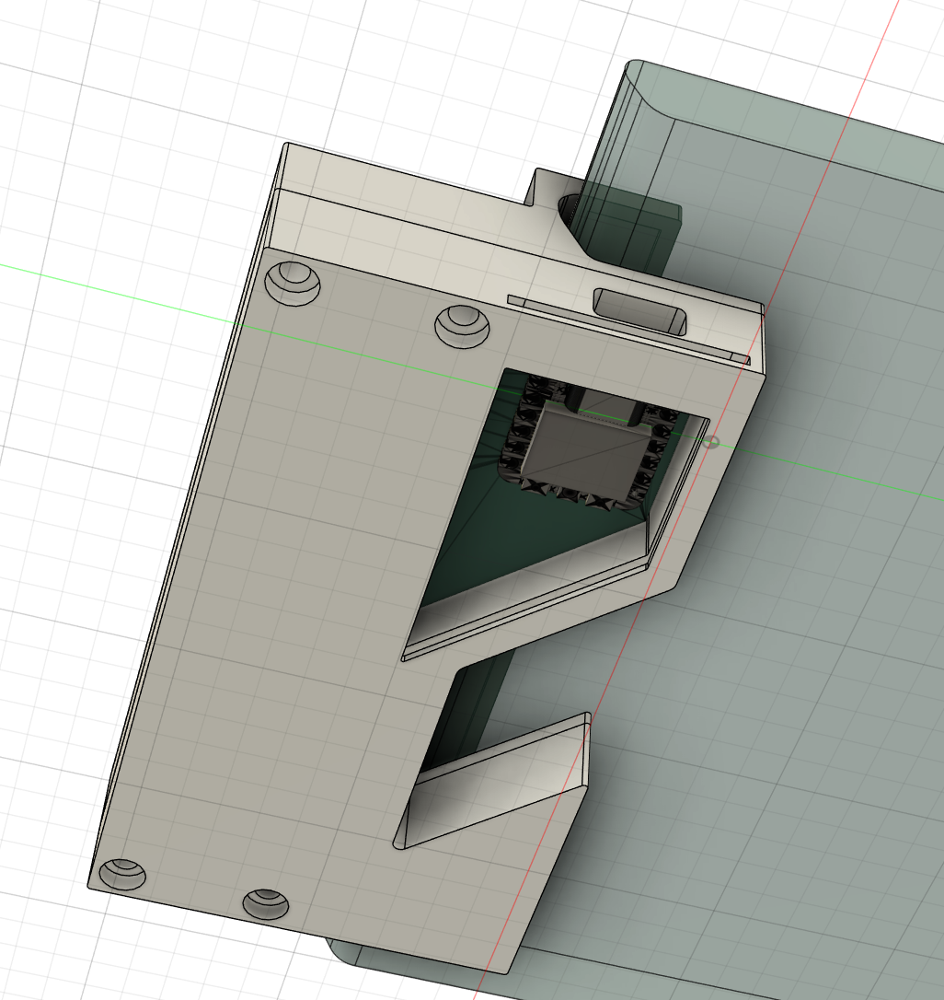
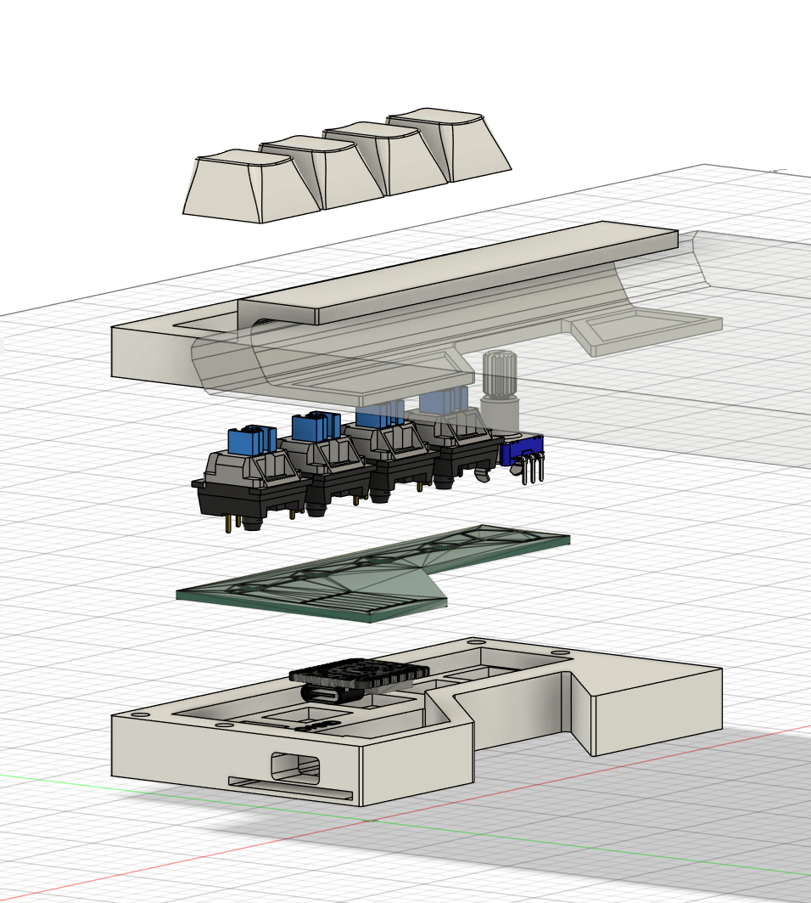
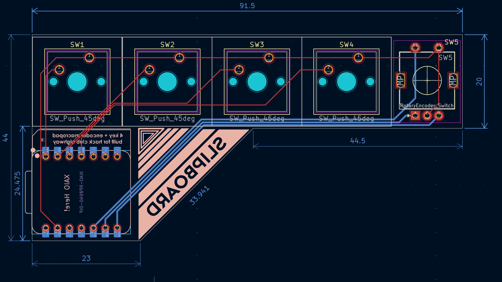
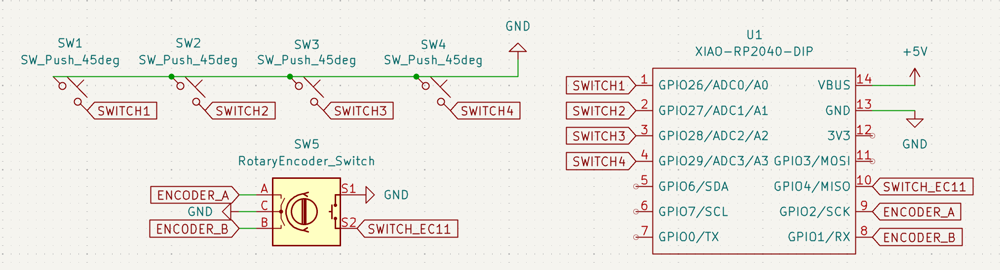

# slipboard
I designed this macropad to slip onto the top of my Surface Pro, since I like to take the keyboard off to draw and watch media in tablet mode, but I also like to be able to copy and paste, undo, and the like. The pen buttons are extremely unhelpful in their utility to say the least, so I created a macropad! As of now, the button layout is as such: 

| undo | copy | paste | delete |
| ---- | ---- | ----- | ------ | 

The encoder press is used to pause/play music, and as of now it's rotation just bound to f13/f14, which I'm hoping to make change my pen size in Krita! 

## CAD
Here's the slipboard slipped onto a mockup section of the Surface Pro! 

I plan to add rubber/silicon to the insets that you can see beneath the tablet, since I own some that I could cut out and glue in myself!  

### back/bottom

I left a slot here for an acrylic sheet to slide in, since I like the look of the PCB and I put a design on the silkscreen that I don't want covered up :3

### disassembled

## PCB/Schematic
I'm a big fan of the look of the raw traces on the PCB, so I utilized that and the silkscreen to make a design that will show through on the backside of the slipboard when its on my tablet! 

### 

## BOM
| Quantity | Material               |
|----------|------------------------|
| 1        | Seeed XIAO RP2040      | 
| 1        | PCB                    |
| 1        | EC11 Rotary encoder    |
| 4        | MX-Style switches      |
| 4        | MX Keycaps             | 
| 1        | 3D printed Case (2pts) |
| 4        | M3x16mm screws         |
| 4        | M3X5X4 Heatset Inserts |

